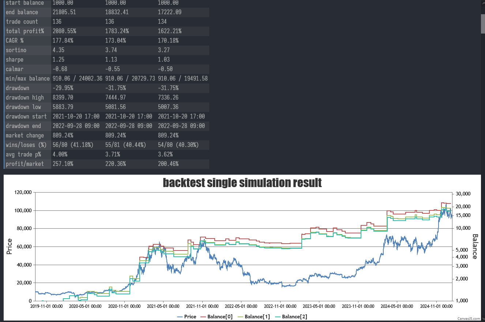

# retsuko-backend

> WIP!

Retsuko, Cryptocurrency algorithmic/systematic/programmatic trading framework

## features

- [x] dataset management
- [x] highly customizable backtesting
  - [x] run bulk backtests
  - [x] debug indicators
- [x] live paper trading
- [x] live trading

## preview

### backtesting single strategy

### backtesting with debugging indicators

### backtesting bulk symbols, intervals, strategies

## how to run

Workign on documentations, coming soon

## strategy

There are included strategies, which are used in live production.

Currently with [SuperTrendTurtle](src/Strategies/SuperTrendTurtle.cs):
- CAGR 80.34%
- Max drawdown -28.96%
